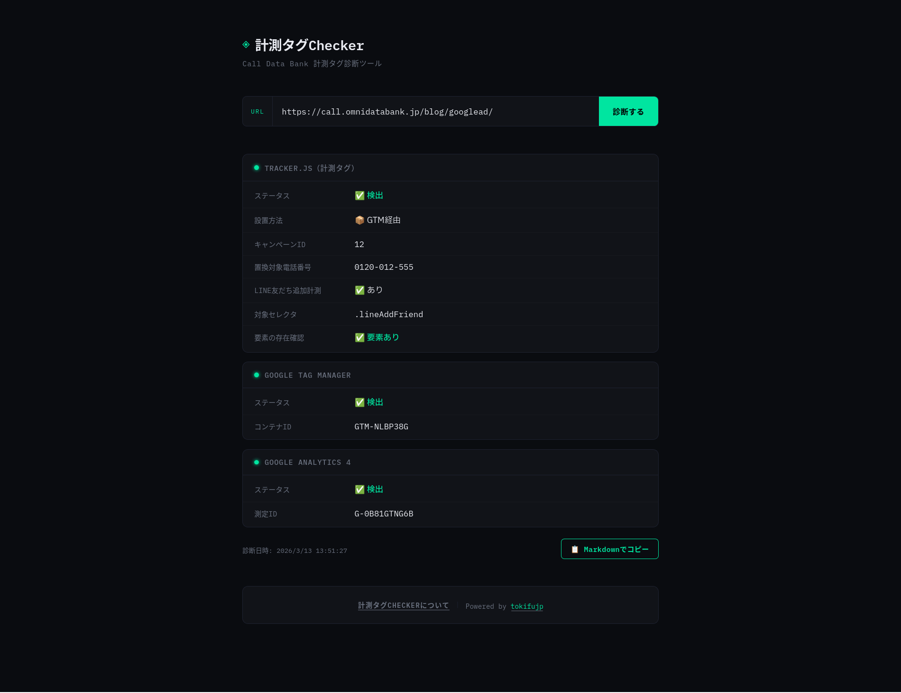

# Tag Checker - Call Data Bank 計測タグ診断ツール

URLを入力するだけで、計測タグ（tracker.js）・GTM・GA4の設置状況を自動診断するツールです。
CSへの「タグが正しく設置されているか確認してほしい」という問い合わせを削減することを目的としています。



## 動くやつ👇

https://tag.tokifuji.dev/

## 診断できること

### tracker.js（計測タグ）

| 項目 | 内容 |
|------|------|
| 設置有無 | tracker.js がページ上で実行されているか |
| 設置方法 | GTM経由 / 直接設置 / 両方 / 不明 |
| キャンペーンID | `odb("start", ID)` の値 |
| 置換対象電話番号 | `odb("phone.trackingNumber", "TEL")` の値（複数対応） |

### LINE友だち追加計測

| 項目 | 内容 |
|------|------|
| 計測設定の有無 | `odb("line.friendadd", ...)` が呼ばれているか |
| 対象セレクタ | 計測タグで指定されているCSSセレクタ（例: `.lineAddFriend`） |
| 要素の存在確認 | 指定セレクタに対応するHTML要素がページ上に存在するか |

> 要素が存在しない場合、エラーログに `LineAddFriendElement not found. (selector: .lineAddFriend)` が表示されます。

### Google Tag Manager

| 項目 | 内容 |
|------|------|
| 設置有無 | GTMタグが設置されているか |
| コンテナID | `GTM-XXXXXXXX` の値 |

### Google Analytics 4

| 項目 | 内容 |
|------|------|
| 設置有無 | GA4タグが設置されているか |
| 測定ID | `G-XXXXXXXXXX` の値 |

### CV送信タグ（Google / Yahoo!）

| 項目 | 内容 |
|------|------|
| 設置有無 | `goog_report_conversion()` / `yahoo_report_conversion()` が `onclick` に含まれているか |
| 引数のtel:有無 | 引数に `tel:` が含まれているか（含まれている場合は要修正） |
| 該当箇所 | 問題のある `onclick` の内容を表示 |

> Call Data Bankの計測タグは `href="tel:xxx"` の番号を置換しますが、`onclick` 内の引数は置換されません。  
> `goog_report_conversion('tel:0120-xxx-xxx')` のように引数に電話番号が入っている場合、CV計測が正しく動作しなくなります。  
> `goog_report_conversion(undefined)` / `yahoo_report_conversion(undefined)` に修正してください。

## 技術仕様

- **GTM経由 / 直接設置の判定**：JS実行前の生HTMLを`fetch`で取得し判定。Puppeteer実行後のDOMではGTMが動的挿入したscriptも含まれるため、生HTMLで判定することで正確に区別しています。
- **odb()のフック**：`evaluateOnNewDocument`で`window.odb`をProxyに差し替え、GTM経由で動的にtracker.jsが読み込まれた場合でも`odb()`の全呼び出しをキャプチャします。
- **GA4の検出**：GTM経由で動的に挿入されるケースに対応するため、`page.content()`（JS実行後のDOM）から取得します。
- **CV送信タグの検出**：`page.evaluate()`でDOM全要素の`onclick`属性を検索し、`goog_report_conversion` / `yahoo_report_conversion` の引数に`tel:`が含まれているかを判定します。
- **認証**：Call Data BankのAPIを使ったログイン認証（sid・email・password）を実装。取得したアクセストークンはHttpOnly Cookieで管理し、未認証ユーザーは診断APIを利用できません。

## 起動方法

### Docker（推奨）

```bash
docker compose up -d
```

http://localhost:3000 でアクセス可能。

### ローカル開発

```bash
npm install
npm run dev
```

> ローカル開発時はシステムにChromiumが必要です。  
> `PUPPETEER_EXECUTABLE_PATH` を環境変数で指定するか、Dockerを使ってください。

## 技術スタック

- Next.js 15 (App Router)
- Puppeteer 24（ヘッドレスChromium）
- TypeScript
- Docker

## 注意事項

- 診断には1回あたり10〜20秒かかります（Puppeteerによるページ実行のため）
- JavaScriptを無効にしているページは正確に診断できない場合があります
- 社内利用を想定しています。外部公開する場合はレート制限を追加してください
- [Call Data Bank](https://call.omnidatabank.jp/?utm_source=tag_checker) は [株式会社ログラフ](https://lograph.co.jp/) の登録商標です
- 本ツールは診断対象サイトの情報を保存せず、第三者への提供も一切行いません
- 本ツールの利用により生じたいかなる損害についても、提供者は責任を負いかねます
